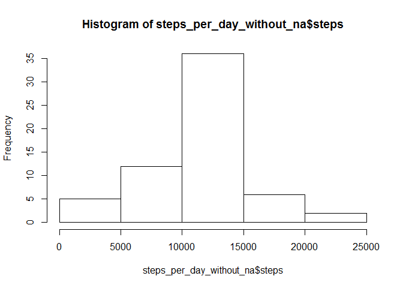

# Reproducible Research: Peer Assessment 1

Author: Laura Varsandan

## Loading and preprocessing the data

Setting up the libraries


```r
.libPaths("C:/R/lib")
library(ggplot2)
library(scales)
```

```
## Warning: package 'scales' was built under R version 3.3.3
```

###1. Code for reading in the dataset and/or processing the data

Reading in the data


```r
activity <- read.csv("activity.csv")
head(activity)
```

```
##   steps       date interval
## 1    NA 2012-10-01        0
## 2    NA 2012-10-01        5
## 3    NA 2012-10-01       10
## 4    NA 2012-10-01       15
## 5    NA 2012-10-01       20
## 6    NA 2012-10-01       25
```

Transforming the columns to the right format


```r
# Date
activity$date <- as.Date(as.character(activity$date), '%Y-%m-%d')

# Time
activity[which(nchar(activity$interval)==3),"interval"] <- paste("0",activity[which(nchar(activity$interval)==3),"interval"], sep="")

activity[which(nchar(activity$interval)==2),"interval"] <- paste("00",activity[which(nchar(activity$interval)==2),"interval"], sep="")

activity[which(nchar(activity$interval)==1),"interval"] <- paste("000",activity[which(nchar(activity$interval)==1),"interval"], sep="")

activity$interval <- paste(substr(activity$interval,1,2),substr(activity$interval,3,4), sep=":")

activity$interval <- as.POSIXct(as.POSIXct(activity$interval, format= "%H:%M"), format="%H:%M")


#activity$interval <- as.factor(activity$interval)
```


###2. Histogram of the total number of steps taken each day


```r
steps_per_day <- aggregate(steps ~ date, data=activity, FUN=sum)

hist(steps_per_day$steps)
```

<!-- -->

### 3. Mean and median number of steps taken each day

The mean number of steps taken each day is 

```r
mean(steps_per_day$steps)
```

```
## [1] 10766.19
```

The median number of steps taken each day is


```r
median(steps_per_day$steps)
```

```
## [1] 10765
```


### 4.Time series plot of the average number of steps taken

Calculating the average number of steps per interval 

```r
steps_per_interval <- aggregate(steps ~ interval, data=activity, FUN=mean)
```

Plotting the results 


```r
lims <- as.POSIXct(strptime(c(min(activity$interval),max(activity$interval)), format="%Y-%m-%d %H:%M"))

p <- ggplot(data=steps_per_interval, aes(x=interval, y=steps, group=1))
p <- p + geom_line()
p <- p + xlab("time interval")
p <- p + ylab("average number of steps taken over the period")
p <- p + scale_x_datetime(limits=lims, breaks=date_breaks("4 hour"), labels=date_format("%H:%M"))
p
```

<!-- -->

### The 5-minute interval that, on average, contains the maximum number of steps


```r
max_steps <- max(steps_per_interval$steps)

format(steps_per_interval[which(steps_per_interval$steps==max_steps), "interval"], format="%H:%M")
```

```
## [1] "08:35"
```

### 6.Code to describe and show a strategy for imputing missing data

the total number of missing values in the dataset


```r
sum(is.na(activity$steps))
```

```
## [1] 2304
```

imputing the missing values with the mean of the  5 minute interval

```r
activity_without_na <- merge(activity, steps_per_interval, by="interval", all.x=TRUE)

activity_without_na[is.na(activity_without_na$steps.x),"steps.x"] <- activity_without_na[is.na(activity_without_na$steps.x),"steps.y"]

activity_without_na$steps.y <- NULL

sum(is.na(activity_without_na$steps.x))
```

```
## [1] 0
```

```r
names(activity_without_na) <- c("interval", "steps", "date")
```

### 7.Histogram of the total number of steps taken each day after missing values are imputed


```r
steps_per_day_without_na <- aggregate(steps ~ date, data=activity_without_na, FUN=sum)

hist(steps_per_day_without_na$steps)
```

<!-- -->


The mean number of steps taken each day is 

```r
mean(steps_per_day_without_na$steps)
```

```
## [1] 10766.19
```

The median number of steps taken each day is


```r
median(steps_per_day_without_na$steps)
```

```
## [1] 10766.19
```

Difference in mean


```r
mean(steps_per_day_without_na$steps)-mean(steps_per_day$steps)
```

```
## [1] 0
```
Difference in median


```r
median(steps_per_day_without_na$steps)-median(steps_per_day$steps)
```

```
## [1] 1.188679
```

### 8.Panel plot comparing the average number of steps taken per 5-minute interval across weekdays and weekends

Calculating the Weekday/weekend values


```r
activity_without_na$WeekDay <- weekdays(activity_without_na$date)

activity_without_na <- within(activity_without_na, 
                   {
                           type_of_day=NA
                           type_of_day[WeekDay %in% c("Monday", "Tuesday", "Wednesday", "Thursday", "Friday")]="weekday"
                           type_of_day[WeekDay %in% c("Saturday", "Sunday")]="weekend"
                   }
                   )


activity_without_na$WeekDay <-NULL
```


Calculating the average number of steps per interval and daytype


```r
steps_per_interval_without_na <- aggregate(steps ~ interval + type_of_day, data=activity_without_na, FUN=mean)
```

Plotting the results 


```r
p <- ggplot(data=steps_per_interval_without_na, aes(x=interval, y=steps, group=1))
p <- p + geom_line()
p <- p + xlab("time interval")
p <- p + ylab("average number of steps taken over the period")
p <- p + scale_x_datetime(limits=lims, breaks=date_breaks("4 hour"), labels=date_format("%H:%M"))
p <- p + facet_grid(.~ type_of_day)
p
```

<!-- -->


